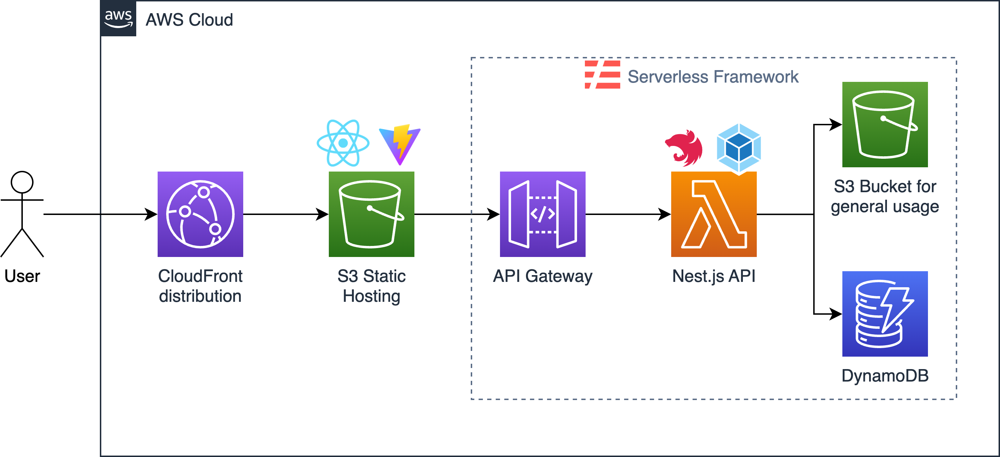
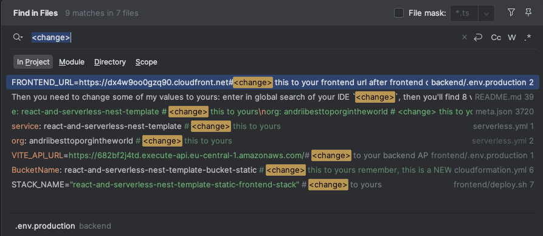

# React with Vite and Serverless Nest template

This template provides a ready-to-use setup for building full-stack applications using **React** (with **Vite**) on the frontend and **NestJS** (deployed via **Serverless** Framework) on the backend. I created it for myself, so everything here is configured like I want but if you want to use it - feel free :)


## 🚀 Features
* **Frontend**:
  * Built with [**React**](https://react.dev/) and [**Vite**](https://vite.dev/).
  * Styled with [**TailwindCSS**](https://tailwindcss.com/) and [**ShadCN**](https://ui.shadcn.com/).
  * Configured with [**ESLint**](https://eslint.org/), [**Prettier**](https://prettier.io/).
  * [**React Query**](https://tanstack.com/query/v3/) for queries.
  * [**Redux Toolkit**](https://redux-toolkit.js.org/) for global storage.

* **Backend**:
  *  Built with [**NestJS**](https://nestjs.com/).
  * [**Serverless**](https://www.serverless.com/) Framework for deployment to [**AWS Lambda**](https://aws.amazon.com/lambda/).
  * [**Webpack**](https://webpack.js.org/) for bundles.
  * Configured [**Swagger**](https://swagger.io/).
  
* **Infrastructure**:
  * Pre-configured [**CloudFormation**](https://aws.amazon.com/cloudformation/) template for setting up [**S3**](https://aws.amazon.com/s3/) and [**CloudFront**](https://aws.amazon.com/cloudfront/).
  * Single-command deployment scripts.
  * .env files for environment-based configurations.


## 🏗️ Architecture

The architecture is pretty straightforward, however for better understanding here is diagram:




## 🛠 Installation

```bash
# Install backend dependencies
cd backend
npm install

# Install frontend dependencies
cd ../frontend
npm install
```

Then you need to change some of my values to yours: enter in global search of your IDE `<change>`, then you'll find 8 values you need to change to yours:




## 💻 Development

### Frontend

Start the frontend development server:
```bash
cd frontend
npm run dev 
```
This will launch the **React** application. You can access it at http://localhost:3000.
### Backend
Start the backend development server (no hot reload unfortunately):
```bash
cd backend
npm run start
```
This will launch the NestJS backend, You can access it at http://localhost:3001. Also, you can open **Swagger** at http://localhost:3001/docs.


## 🚢 Deployment

1. Deploy frontend:
```bash
bash ./frontend/deploy.sh
```
2. Copy frontend URL that was written to console.
3. Paste this URL to `/backend/.env.production` to the variable `API_URL` **without!!!** slash `/` at the end.
4. Deploy backend:
```bash
bash ./backend/deploy.sh
```
5. Copy backend API URL that was written to console.
6. Paste this URL to `/frontend/.env.production` to the variable `VITE_API_URL`.

For the future deployments simply run deploy commands.


## 📂 Project Structure
### Frontend
    frontend/
    ├── public/             # Static assets (e.g., images, fonts)
    ├── src/
    │   ├── assets/         # Statis assets folder #2
    │   ├── components/     # Reusable UI components, other than shadcn
    │   ├── hooks/
    │   ├── pages/          
    │   ├── services/       # Requests to API
    │   ├── shadcn/         # Only shadcn components
    │   ├── store/          # Configured Redux
    │   ├── types/          
    │   └── utils/
    ├── .env.development    # Local environment variables
    ├── .env.production     # Production environment variables
    ├── cloudformation.yml 
    └── deploy.sh           # Deployment script for frontend (S3 and CloudFront)

### Backend
    backend/
    ├── src/                  
    │   ├── aws/              # AWS-specific module
    │   ├── cats/             # Example feature or module
    │   ├── common/
    │   ├── utils/
    │   ├── app.module.ts
    │   ├── main.ts
    │   ├── .env.development  # Local environment variables
    │   └── .env.production   # Production environment variables
    ├── deploy.sh             # Deployment script
    ├── serverless.yml
    └── webpack.config.js

